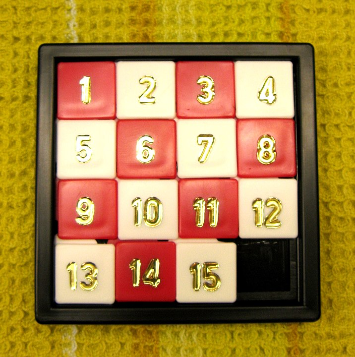
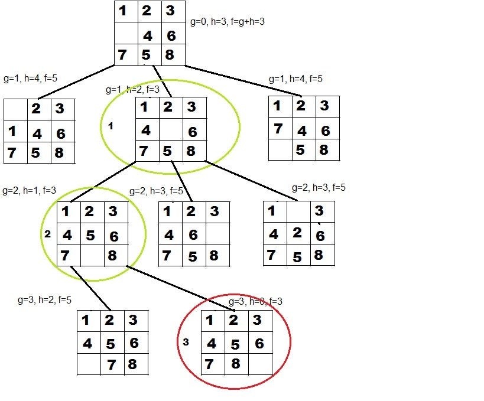
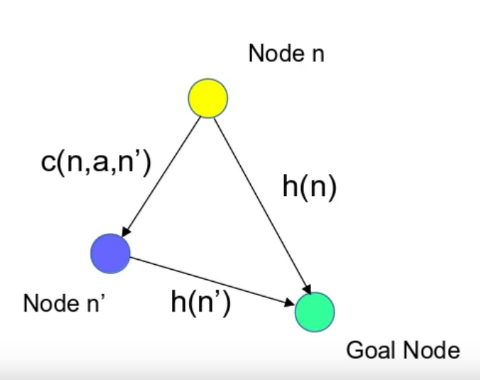

# N-Puzzle solver using A* search algorithm


## About n-puzzle

The n-puzzle is a sliding puzzle with n×n - 1 numbered tiles in an n×n frame, leaving one empty spot. Tiles can slide horizontally or vertically into the open space. The goal is to arrange the tiles in spiral order.



## Pre-knowledge
- Basics of graph theory
- Dijkstra’s algorithm
- BFS and DFS

## key concepts
- A* algorithm
- Heuristic functions
- Admissible Heuristic
- Consistent Heuristic
- Priority Queue

## A*
A* is a best-first search algorithm that finds the shortest path from a start node to a goal node. It uses a combination of the actual cost from the start node and a heuristic estimate to guide its search.

## Heuristic function

A function that prioritizes options in search algorithms at each branching step based on available information to guide the search direction.

**Admissible Heuristic**: A heuristic is admissible if it never overestimates the true cost to reach the goal.

**Consistent heuristic**: heuristic `h` is consistent if for any node n and its successor n′ \
$ h(n) ≤ c(n,n′)+h(n′) $
- basically it ensures that the estimated cost to reach the goal from a node does not decrease when transitioning from one node to another.



## Used Heuritics

- Manhattan distance
- linear conflicts
  - If two tiles are in the same row/column, and their goal positions are in the same row/colum, a linear conflict happens.
  - `Linear Conflict` = `Manhattan Distance` + 2 × `(number of linear conflicts)`
- Euclidean distance
- Hamming distance 
  - Out of place tiles

## Informations

- Uninformed Search
  - Does not use any heuristic information. like (Breath first search and depth first search)
- Informed Search
  - Uses a heuristic to guide the search. like A*
- Uniform-Cost Search
  - Finds the optimal path, `complete` (guaranteed to find a solution if one exists), does not require a heuristic.
  - Slower and more memory-intensive due to exhaustive exploration.
- Greedy Search
  - Faster and efficient with a good heuristic, less memory-intensive.
  - Not guaranteed to find the optimal path, performance dependent on the quality of the heuristic.

## Usage

```
# Generate the puzzle

python3 ./src/npuzzle-gen.py 3 -s > puzzle.txt # generate a solvable puzzle of size 3
```
```
# Or

make generator && ./npuzzle-gen.out 3 -s > puzzle.txt
```
```
make && ./n-puzzle.out -f puzzle.txt --manhattan
```

```
Usage: n-puzzle [-f {file_input}] ... [Heuristics] ... [SearchType]

Heuristics:
--manhattan: uses manhattan distance
--conflicts: linear conflicts
--euclidean: euclidean distance
--hamming: hamming distance aka "tiles out of place"

Search Type:
-g: greedy search: ignores the g(n) in A* formula f(n) = g(n) + h(n), quickly finds solution.
-u: uniform cost search: discards the h(n) in A* formula.
```


## Resources
- [Graph theory](http://ericshen.net/handouts/ZC-graph.pdf)
- [Basic graph theory](https://math.mit.edu/~dunkel/Teach/18.S995_2017F/slides/lec26_GraphBasics.pdf)
- [Graph | Data Structures & Algorithms](https://www.youtube.com/playlist?list=PLqM7alHXFySEaZgcg7uRYJFBnYMLti-nh)
- [N-Puzzle game](https://n-puzzle.baletskyi.me/)
- [Introduction to the A* Algorithm](https://www.redblobgames.com/pathfinding/a-star/introduction.html)
- [A Comparison of Path finding Algorithms](https://www.youtube.com/watch?v=GC-nBgi9r0U)
- [Admissible and Consistent Heuristics](https://www.youtube.com/watch?v=0K0H-z7HZ1o&list=PLMkc4jtBIGqnFpr_GdZv4V8OBz7jb5DAU&index=26)
- [Informed search algorithms](https://courses.cs.washington.edu/courses/csep573/11wi/lectures/03-hsearch.pdf)

